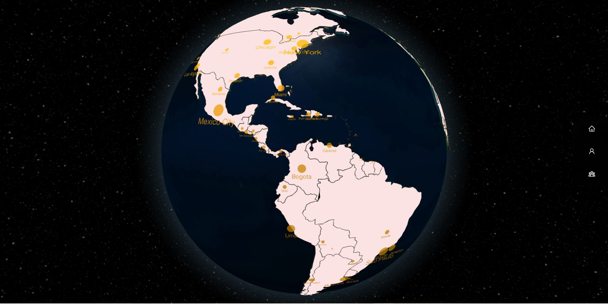

## Travelr

- [Live Link to Heroku APP]()

## Table of Contents

- [Description](#description)
- [User Story](#user-story)
- [Acceptance Criteria](#acceptance-criteria)
- [Technologies Used](#technologies-used)
- [Developers](#developers)
- [License](#License)

## Description

This is an app tailored to different types of people. On one hand, you can browse through the cities and countries that appear on the globe, click on them, and get general information about that location. On the other hand, the app also allows individuals to create user profiles which allow them to keep track of all the beautiful places around the world they have visited, plan future expeditions, and chat with friends and strangers alike.

## User Story

I WANT to click on a city
SO THAT I can get general information about that city and add it to a list of favorites, places visited, and participate in a chat

## Acceptance Criteria

GIVEN I am using this app
WHEN I get to the landing page
THEN I see an interactive globe of the world
WHEN I log in or sign up for an account
THEN I can click on a city to get general information about it
WHEN I click on city
THEN I am presented with general information on that city
WHEN I click on the heart button,
THEN the city is added to my favorites list
WHEN I click on the “plus” button
THEN the city is added to a list of places visited
WHEN I click on the “rows” button
THEN the city is added to a bucket list
WHEN I click on the chat button
THEN I am taken to a chat page for that specific city
WHEN I click on the home button
THEN I am taken back to the globe and I can select another location

## Technologies Used

- 
- 
- 
- 
- 
- 
- 
- 
- 
- 
- 
- 

## Developers

- Jared Schips (JaredSchips) [Link to Github](https://github.com/JaredSchips)
- Omar Correa (Omar-Correa)[Link to Github](https://github.com/omar-correa)
- Martin Cespedes (MartinCespedes) [Link to Github](https://github.com/MartinCespedes)
- Vlada Bolotova (Vlada) [Link to Github](https://github.com/VladaBolotova)

## Licenses

Copyright (c) 2023 project-travelr

This software is copyrighted by the project-travelr team. All rights reserved.

This project is covered under the MIT License.
